# i3-colors

Simple Python i3 colors manager. 
**Install/Usage:**

      git clone https://gitlab.com/manzerbredes/i3-colors
      ./i3-colors/src/i3-colors.py -h
    
**Notes:** Some of the themes come from [i3-style project](https://github.com/altdesktop/i3-style)

### Screenshots

alphare:
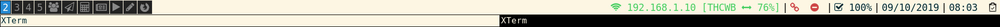

archlinux:
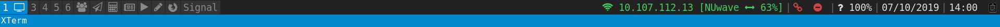

base16-tomorrow:
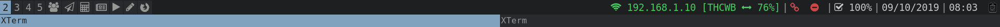

debian:
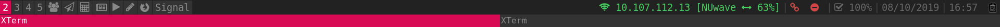

deep-purple:
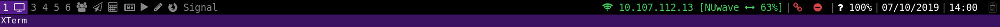

default:
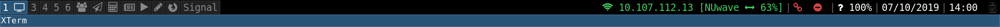

flat-gray:
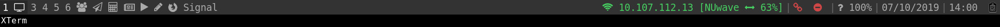

gruvbox:
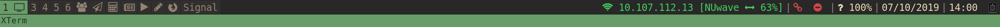

icelines:
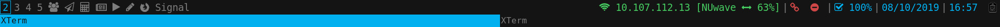

lime:
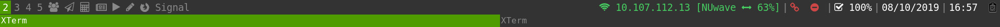

mate:
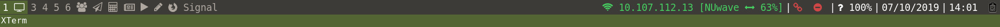

oceanic-next:
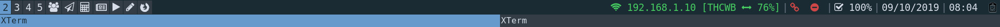

okraits:
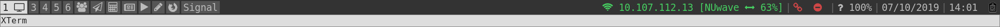

purple:
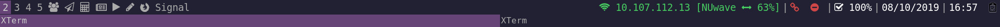

seti:
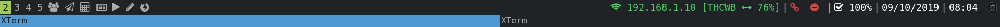

slate:
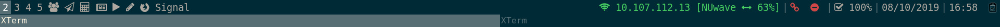

solarized:
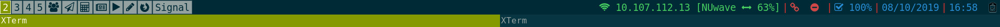

tomorrow-night-80s:

ubuntu:
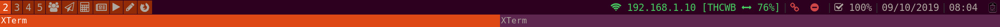
