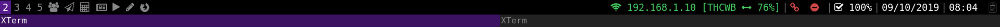
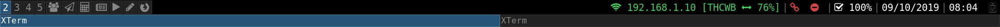
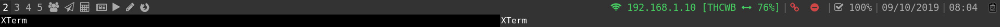
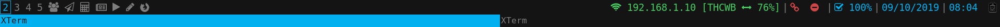
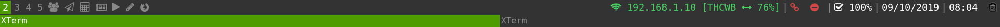
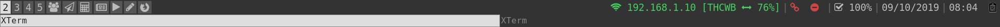
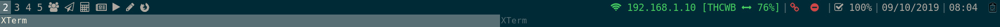
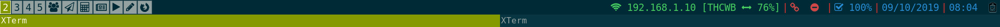
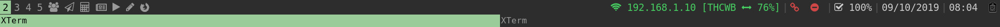

# i3-colors

Simple Python i3 colors manager. 
**Install/Usage:**

      git clone https://gitlab.com/manzerbredes/i3-colors
      ./i3-colors/src/i3-colors.py -h
    
**Notes:** Some of the themes come from [i3-style project](https://github.com/altdesktop/i3-style)

### Screenshots

alphare:

archlinux:

base16-tomorrow:

debian:

deep-purple:

default:

flat-gray:

gruvbox:

icelines:

lime:

mate:

oceanic-next:

okraits:

purple:

seti:

slate:

solarized:

tomorrow-night-80s:

ubuntu:

