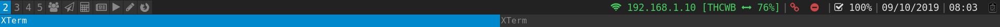
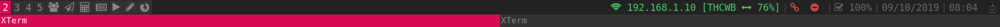
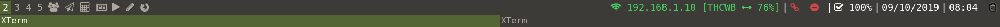
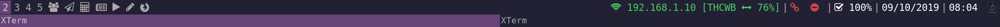
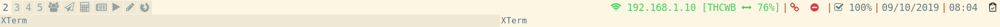

# i3-colors

Simple Python i3 colors manager. 
**Install/Usage:**

      git clone https://gitlab.com/manzerbredes/i3-colors
      ./i3-colors/src/i3-colors.py -h
    
**Notes:** Some of the themes come from [i3-style project](https://github.com/altdesktop/i3-style) and [j4-make-config](https://github.com/okraits/j4-make-config)

### Features
- Instant theme changing: `./i3-colors.py apply -r <theme-path>`
- Theme extraction from config file (as yaml): `./i3-colors.py extract <i3-config-file>`
- Apply random colors to i3: `./i3-colors.py aleatory`

### Help
You can have help with the following commands:
- `./i3-colors.py apply -h`
- `./i3-colors.py extract -h`
- `./i3-colors.py aleatory -h`

### Screenshots

alphare:

archlinux:

base16-tomorrow:

breeze:

debian:

deep-purple:

default:

flat-gray:

google:

gruvbox:

icelines:

ion3:

lime:

mate:

oceanic-next:

okraits:

old-school:

purple:

seti:

slate:

solarized:

solarized_light:

tomorrow-night-80s:

ubuntu:

wc8:

